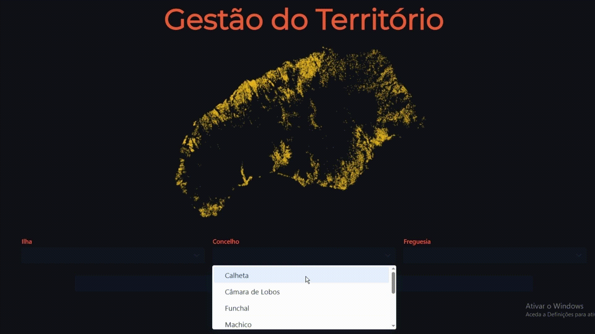

# Territorial Cohesion Monitoring & Action

## 🎥 Demonstration Video



---

## 📝 General Description

This project was developed as part of the **Software Engineering** course, with the goal of implementing an application for **territorial management**. The project follows the **Scrum** methodology and features an **iterative and incremental development cycle**.

---

## 🛠️ Technologies and Tools Used

### 🔧 Backend
- **Java 21**
- **Spring Boot 3.2.4**
- **Vaadin 24.3.0**
- **JTS (Java Topology Suite)** for spatial geometry
- **Apache Commons CSV** for parsing CSV files
- **Gson** for JSON manipulation

### 💻 Frontend
- **Vaadin Flow** with custom components
- **v-leaflet** for interactive map visualisation
- **HTML/CSS/JavaScript** with custom scripts (`area-media-viewer.js`, `leaflet-map-viewer.js`, etc.)

### 📦 Dependency Management
- **Maven** (`pom.xml` with centralised version control)

### 🧪 Testing
- **JUnit 4.13.2**
- **Maven Surefire Plugin**
- **JACOCO 8.13**

### 🛠️ Supporting Tools
- **Git** and **GitHub** for version control and collaboration
- **Trello / GitHub Projects** for agile management with **Scrum**
- **JavaDoc** for automatic code documentation
- **Test coverage tools** (e.g., JaCoCo or IntelliJ Coverage)

---

## 📁 Project Structure
```
Terrain-Fragmentation-Helper
├── frontend/                    # UI and visualisation (Vaadin/JS)
│   └── themes/                  # Custom visual theme (CSS)
├── src/
│   └── main/
│       ├── java/
│       │   └── iscte/lige/k/
│       │       ├── dataStructures/   # Core structures: Property, Owner, Trade, etc.
│       │       ├── service/          # Business logic and data loading
│       │       ├── util/             # Utilities like trade evaluation and SVG generation
│       │       └── views/            # View rendering and SVG generation
│       └── resources/         # Configuration files and resources
│
├── test/
│   └── java/
│       └── iscte/lige/k/      # JUnit tests organised by package
│
├── pom.xml                    # Maven dependency and build management
├── application.properties     # Spring Boot configuration
├── README.md                  # Project overview
├── target/                    # Compiled code and generated files
└── docs/                      # Project documentation and quality control
      ├── documentation/              # JavaDoc HTML
      ├── tests-and-quality-assurance/ # JaCoCo reports and IDE coverage
      └── trello/                    # Scrum board screenshots
```

---

## 🧪 Testing and Coverage

- All tests implemented using **JUnit 4**
- Test coverage exceeds **50%** in at least two metrics, including **cyclomatic complexity** and **line coverage**
- Tests can be executed via IDE or terminal using `mvn test`

---

## 📊 Software Quality Report

The software quality report was generated using **DESIGNATE** and is available in the `docs/` folder.

---

## 📚 JavaDoc

The technical documentation was generated using JavaDoc and is located in `/docs/documentation/apidocs`, accessible via the `index.html` file.

---

## 🗓️ Agile Management with Scrum

- Management tool: **Trello**
- Sprint planning with defined tasks
- Documentation of:
  - Product Backlog
  - Sprint Planning
  - Sprint Review & Retrospective
  - Burndown Charts
- Traceability ensured through commits and pull requests linked to user stories

---

📺 YouTube Video Link: https://youtu.be/fU-ICmFsbWs

The video showcases:
- Agile project management (Scrum)
- GitHub repository structure
- JUnit test execution and coverage
- Working application features
- Libraries and tools used

---

## ✅ Final Status

✔ Fully functional project  
✔ All tests passing  
✔ Quality assessed and documented  
✔ Complete JavaDoc  
✔ Scrum process documented  
✔ Deliverables organised in the repository
